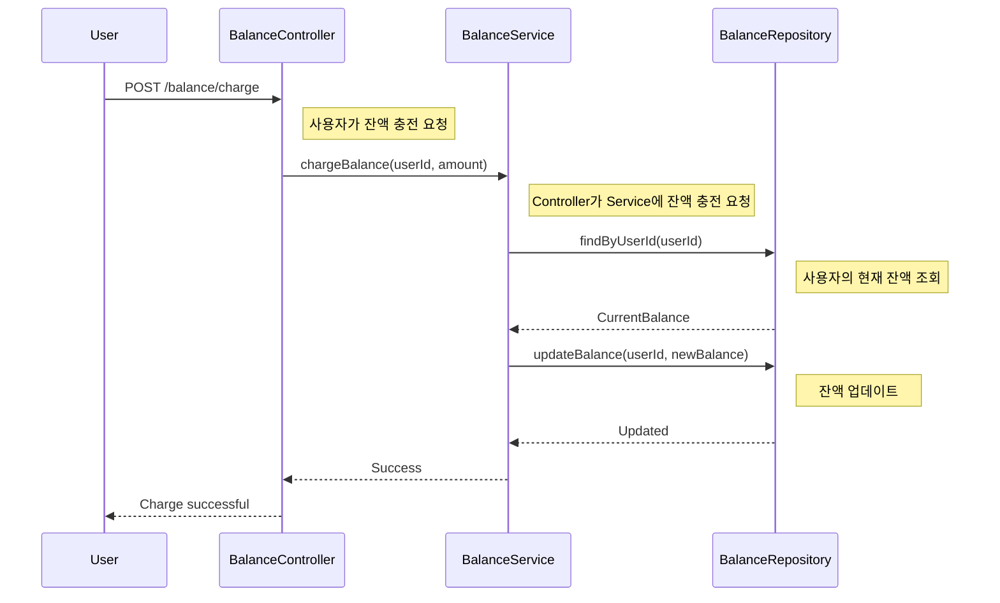

```mermaid
sequenceDiagram
participant User
participant BC as BalanceController
participant BS as BalanceService
participant BR as BalanceRepository

    User->>BC: POST /balance/charge
    Note right of BC: 사용자가 잔액 충전 요청
    BC->>BS: chargeBalance(userId, amount)
    Note right of BS: Controller가 Service에 잔액 충전 요청
    BS->>BR: findByUserId(userId)
    Note right of BR: 사용자의 현재 잔액 조회
    BR-->>BS: CurrentBalance
    BS->>BR: updateBalance(userId, newBalance)
    Note right of BR: 잔액 업데이트
    BR-->>BS: Updated
    BS-->>BC: Success
    BC-->>User: Charge successful
```
