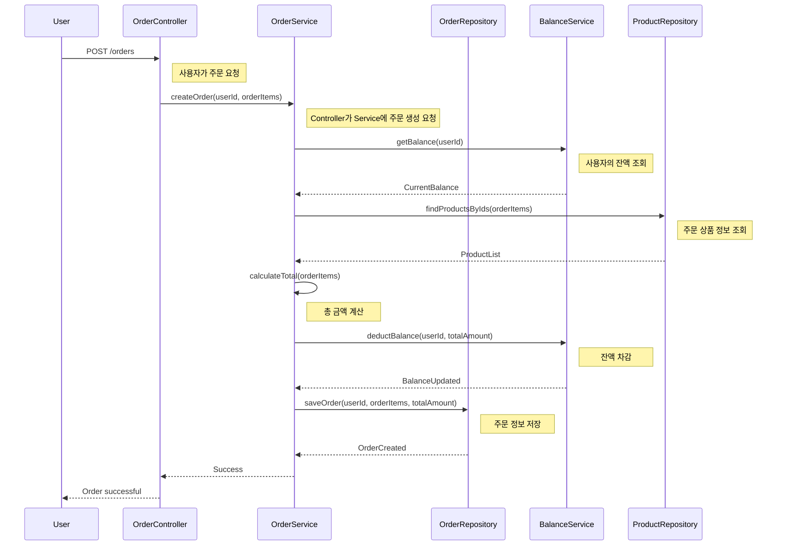

```mermaid
sequenceDiagram
    participant User
    participant OC as OrderController
    participant OS as OrderService
    participant OR as OrderRepository
    participant BC as BalanceService
    participant PR as ProductRepository

    User->>OC: POST /orders
    Note right of OC: 사용자가 주문 요청
    OC->>OS: createOrder(userId, orderItems)
    Note right of OS: Controller가 Service에 주문 생성 요청
    OS->>BC: getBalance(userId)
    Note right of BC: 사용자의 잔액 조회
    BC-->>OS: CurrentBalance
    OS->>PR: findProductsByIds(orderItems)
    Note right of PR: 주문 상품 정보 조회
    PR-->>OS: ProductList
    OS->>OS: calculateTotal(orderItems)
    Note right of OS: 총 금액 계산
    OS->>BC: deductBalance(userId, totalAmount)
    Note right of BC: 잔액 차감
    BC-->>OS: BalanceUpdated
    OS->>OR: saveOrder(userId, orderItems, totalAmount)
    Note right of OR: 주문 정보 저장
    OR-->>OS: OrderCreated
    OS-->>OC: Success
    OC-->>User: Order successful

```