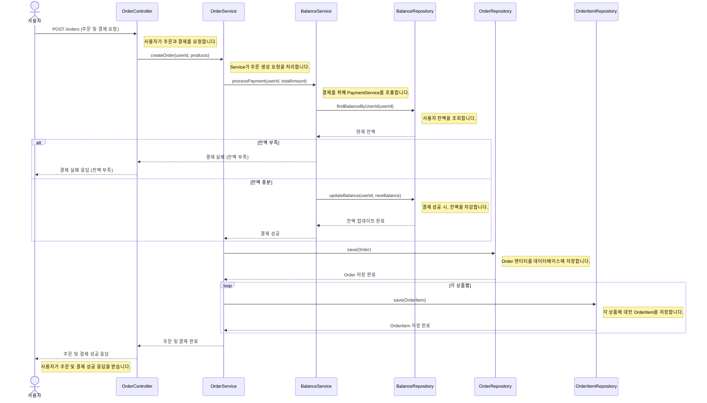

```mermaid
sequenceDiagram
    actor User as 사용자
    participant OC as OrderController
    participant OS as OrderService
    participant BS as BalanceService
    participant BR as BalanceRepository
    participant OR as OrderRepository
    participant OIR as OrderItemRepository

    User ->> OC: POST /orders (주문 및 결제 요청)
    note right of OC: 사용자가 주문과 결제를 요청합니다.

    OC ->> OS: createOrder(userId, products)
    note right of OS: Service가 주문 생성 요청을 처리합니다.

    OS ->> BS: processPayment(userId, totalAmount)
    note right of BS: 결제를 위해 PaymentService를 호출합니다.

    BS ->> BR: findBalanceByUserId(userId)
    note right of BR: 사용자 잔액을 조회합니다.

    BR -->> BS: 현재 잔액

    alt 잔액 부족
        BS -->> OC: 결제 실패 (잔액 부족)
        OC -->> User: 결제 실패 응답 (잔액 부족)
    else 잔액 충분
        BS ->> BR: updateBalance(userId, newBalance)
        note right of BR: 결제 성공 시, 잔액을 차감합니다.

        BR -->> BS: 잔액 업데이트 완료
        BS -->> OS: 결제 성공
    end

    OS ->> OR: save(Order)
    note right of OR: Order 엔티티를 데이터베이스에 저장합니다.

    OR -->> OS: Order 저장 완료

    loop 각 상품별
        OS ->> OIR: save(OrderItem)
        note right of OIR: 각 상품에 대한 OrderItem을 저장합니다.
        OIR -->> OS: OrderItem 저장 완료
    end

    OS -->> OC: 주문 및 결제 완료

    OC -->> User: 주문 및 결제 성공 응답
    note right of User: 사용자가 주문 및 결제 성공 응답을 받습니다.


```