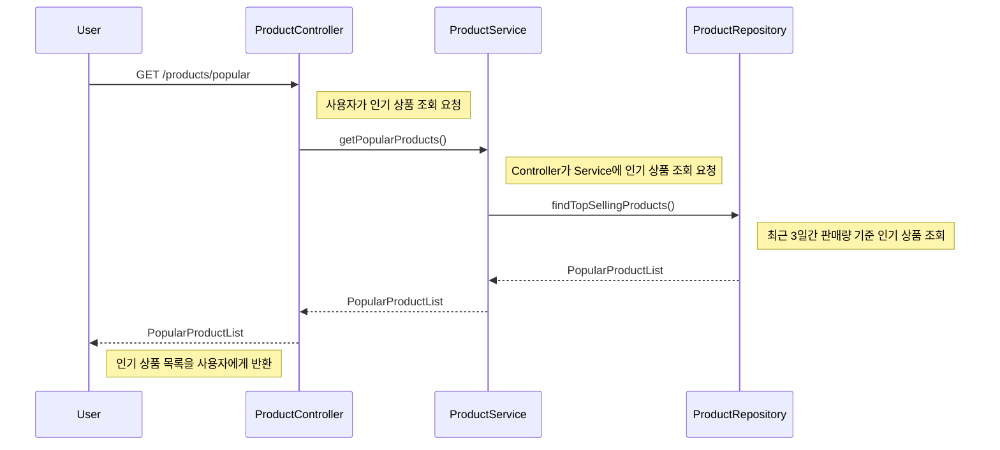

```mermaid
sequenceDiagram
    participant User
    participant PC as ProductController
    participant PS as ProductService
    participant PR as ProductRepository

    User->>PC: GET /products/popular
    Note right of PC: 사용자가 인기 상품 조회 요청
    PC->>PS: getPopularProducts()
    Note right of PS: Controller가 Service에 인기 상품 조회 요청
    PS->>PR: findTopSellingProducts()
    Note right of PR: 최근 3일간 판매량 기준 인기 상품 조회
    PR-->>PS: PopularProductList
    PS-->>PC: PopularProductList
    PC-->>User: PopularProductList
    Note right of User: 인기 상품 목록을 사용자에게 반환

``` 