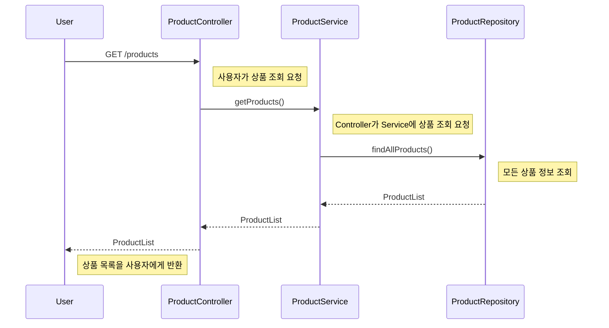

```mermaid
sequenceDiagram
participant User
participant PC as ProductController
participant PS as ProductService
participant PR as ProductRepository

    User->>PC: GET /products
    Note right of PC: 사용자가 상품 조회 요청
    PC->>PS: getProducts()
    Note right of PS: Controller가 Service에 상품 조회 요청
    PS->>PR: findAllProducts()
    Note right of PR: 모든 상품 정보 조회
    PR-->>PS: ProductList
    PS-->>PC: ProductList
    PC-->>User: ProductList
    Note right of User: 상품 목록을 사용자에게 반환
```
