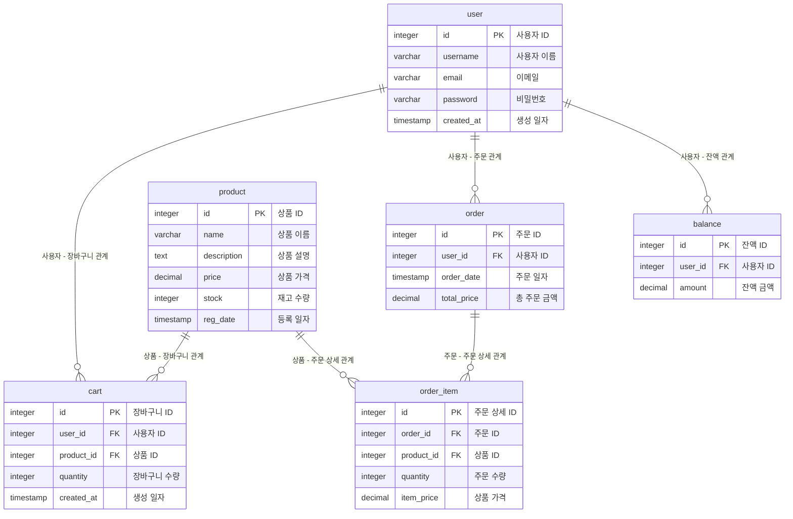

## e 커머스 ERD

```mermaid
erDiagram

    %% 사용자 테이블
    user {
        integer id PK "사용자 ID"
        varchar username "사용자 이름"
        varchar email "이메일"
        varchar password "비밀번호"
        timestamp created_at "생성 일자"
    }

    %% 잔액 테이블
    balance {
        integer id PK "잔액 ID"
        integer user_id FK "사용자 ID"
        decimal amount "잔액 금액"
    }

    %% 상품 테이블
    product {
        integer id PK "상품 ID"
        varchar name "상품 이름"
        text description "상품 설명"
        decimal price "상품 가격"
        integer stock "재고 수량"
        timestamp reg_date "등록 일자"
    }

    %% 주문 테이블
    order {
        integer id PK "주문 ID"
        integer user_id FK "사용자 ID"
        timestamp order_date "주문 일자"
        decimal total_price "총 주문 금액"
    }

    %% 주문 상세 테이블
    order_item {
        integer id PK "주문 상세 ID"
        integer order_id FK "주문 ID"
        integer product_id FK "상품 ID"
        integer quantity "주문 수량"
        decimal item_price "상품 가격"
    }

    %% 장바구니 테이블
    cart {
        integer id PK "장바구니 ID"
        integer user_id FK "사용자 ID"
        integer product_id FK "상품 ID"
        integer quantity "장바구니 수량"
        timestamp created_at "생성 일자"
    }

    %% 관계 정의
    user ||--o{ balance : "사용자 - 잔액 관계"
    user ||--o{ order : "사용자 - 주문 관계"
    user ||--o{ cart : "사용자 - 장바구니 관계"
    order ||--o{ order_item : "주문 - 주문 상세 관계"
    product ||--o{ order_item : "상품 - 주문 상세 관계"
    product ||--o{ cart : "상품 - 장바구니 관계"

```