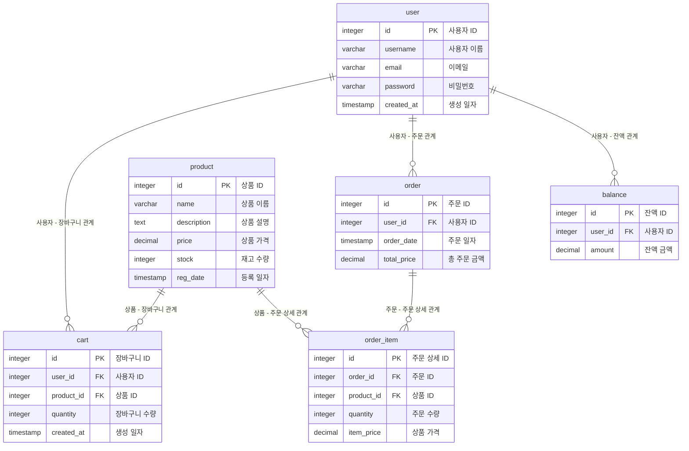

## e 커머스 ERD

---

---

### 테이블 설명

1. **사용자 (user)**:
    - **속성**: 사용자 ID, 이름, 이메일, 비밀번호, 생성 일자
    - **설명**: 시스템의 사용자 정보를 저장합니다.
2. **잔액 (balance)**:
    - **속성**: 잔액 ID, 사용자 ID, 잔액 금액
    - **설명**: 각 사용자의 잔액 정보를 관리합니다.
3. **상품 (product)**:
    - **속성**: 상품 ID, 이름, 설명, 가격, 재고 수량, 등록 일자
    - **설명**: 판매하는 상품의 정보를 저장합니다.
4. **주문 (order)**:
    - **속성**: 주문 ID, 사용자 ID, 주문 일자, 총 주문 금액
    - **설명**: 사용자가 생성한 주문 정보를 기록합니다.
5. **주문 상세 (order_item)**:
    - **속성**: 주문 상세 ID, 주문 ID, 상품 ID, 주문 수량, 상품 가격
    - **설명**: 특정 주문에 포함된 상품과 그 수량을 기록합니다. 다.
6. **장바구니 (cart)**:
    - **속성**: 장바구니 ID, 사용자 ID, 상품 ID, 장바구니 수량, 생성 일자
    - **설명**: 사용자가 선택한 상품을 임시로 저장하는 기능을 제공합니다.

---
