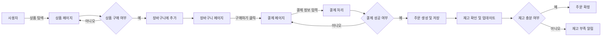

```mermaid
flowchart LR
    A[사용자] -->|상품 탐색| B[상품 페이지]
    B --> C{상품 구매 여부}
    C -->|예| D[장바구니에 추가]
    C -->|아니오| B
    D --> E[장바구니 페이지]
    E -->|구매하기 클릭| F[결제 페이지]
    F -->|결제 정보 입력| G[결제 처리]
    G --> H{결제 성공 여부}
    H -->|예| I[주문 생성 및 저장]
    H -->|아니오| F
    I --> J[재고 확인 및 업데이트]
    J --> K{재고 충분 여부}
    K -->|예| L[주문 확정]
    K -->|아니오| M[재고 부족 알림]
```