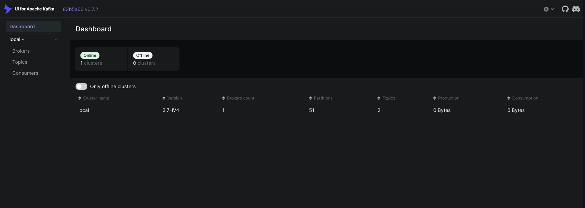

# 카프카 연동 및 테스트

---
## 설치 및 실행
[docker-compose.yml](../../docker-compose.yml)
- kafka
- zookeeper
- kafka-ui

[application.yml](../../src/main/resources/application.yml)
- consumer, producer 설정
---

### Kafka 연결 로그 확인

### Kafka-ui-main

### HTTP-Client-test

### Topic(order-create)

### Topic-message

### Consumer

### Outbox-data

### Platform-api 메시지 출력

### Scheduled 테스트

- 그전에 스케줄 로그가 있었는데.. 그거 캡쳐가 안된것같습니다 ;ㅅ;...

