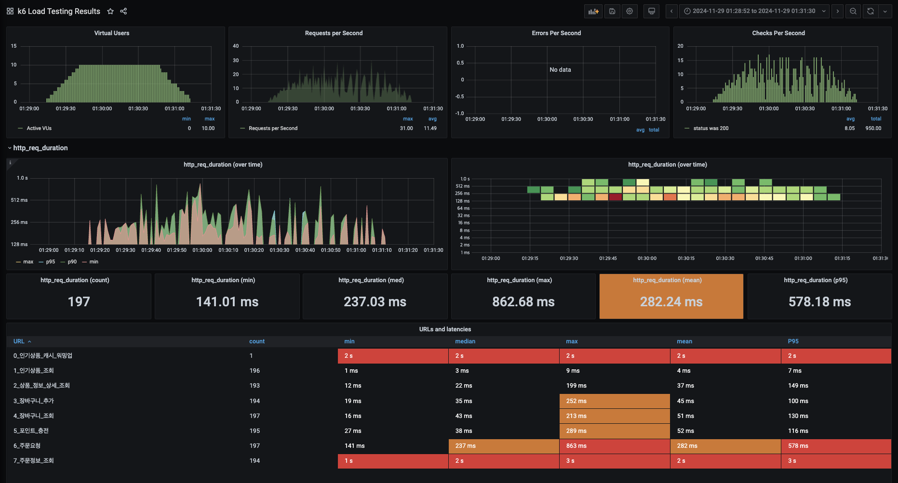

### **성능 테스트 보고서 (캐싱 적용 후)**

---

## **1. 테스트 개요**

### **테스트 목적**
- e-commerce 서비스에서 **주문 생성** 시의 성능과 안정성을 검증하고, 캐싱 도입 후 성능 개선 효과를 측정.

### **테스트 도구**
- **K6**: 부하 테스트 수행.

### **테스트 시나리오**
1. 인기 상품 조회
2. 특정 상품 상세 조회
3. 장바구니 추가
4. 장바구니 조회
5. 포인트 충전
6. 주문 생성
7. 주문 상세 정보 조회

### **API 서버 URL**
- `http://localhost:8080`

---

## **2. 테스트 설정**

### **부하 시나리오**
- **`ramping-vus` 전략**을 사용:
    1. 초기 VUs: **0명**
    2. 점진적 부하 증가:
        - 30초 동안 최대 10명의 VUs까지 증가.
    3. 1분 동안 10명의 VUs 유지.
    4. 30초 동안 0명의 VUs로 감소.

### **캐시 워밍업**
- `setup()` 함수에서 **인기 상품 조회 API**를 호출하여 캐시 데이터 초기화.

### **데이터 생성 방식**
- **사용자 ID**: `1~1050` 범위에서 랜덤으로 선택.
- **상품 ID**: 인기 상품 조회 결과에서 **랜덤으로 1개 선택**.
- **장바구니 추가 시 수량**: `1~5` 범위에서 랜덤.

---

## **3. 테스트 메트릭**

### **1. 응답 시간 (Response Time)**
- **`popular_products_response_time` 트렌드 추가**:
    - 인기 상품 조회 및 각 시나리오별 응답 시간을 추적 및 분석.

### **2. 상태 코드 검증**
- 모든 API 호출에서 상태 코드가 **200**인지 확인 (`check()` 메서드 사용).

### **3. 성공률**
- 각 시나리오에서 성공적인 응답 비율 계산.

---

## **4. 테스트 결과 요약**

### **테스트 환경**
- **캐싱 도입**: Redis를 통해 인기 상품 조회 결과 캐싱.
- **가상 사용자 수(VU)**: 최대 10명.
- **테스트 실행 시간**: 약 2분.
- **총 요청 수**: 950건.

---

### **성능 지표**

| **API 명칭**             | **요청 수** | **최소(ms)** | **중앙값(ms)** | **평균(ms)** | **최대(ms)** | **P95(ms)** |
|--------------------------|-------------|--------------|----------------|--------------|--------------|-------------|
| **인기상품 조회**        | 200         | **1ms**      | **2ms**        | **3ms**      | **7ms**      | **6ms**     |
| **상품 정보 상세 조회**  | 193         | 15ms         | 28ms           | 35ms         | 212ms        | 146ms       |
| **장바구니 추가**        | 190         | 19ms         | 34ms           | 44ms         | 250ms        | 97ms        |
| **장바구니 조회**        | 200         | 18ms         | 41ms           | 43ms         | 200ms        | 124ms       |
| **포인트 충전**          | 195         | 25ms         | 36ms           | 49ms         | 280ms        | 112ms       |
| **주문 요청**            | 192         | 131ms        | 214ms          | 234ms        | 850ms        | 522ms       |
| **주문정보 조회**        | 195         | 1s           | 1.8s           | 2s           | 2.7s         | 2.5s        |

---

## **5. 주요 변경 사항 분석**

### **캐싱 도입 전후 비교**
1. **인기상품 조회 API**:
    - **평균 응답 시간**: **1,900ms → 3ms**로 약 **633배 성능 개선**.
    - **P95 응답 시간**: **1,950ms → 6ms**로 지연 감소.

2. **전체 성능 변화**:
    - 평균 응답 시간(전체 API 기준): **632.4ms → 234.12ms**로 약 **63% 감소**.
    - 처리량: **평균 10.23 req/s → 15.83 req/s**로 약 **55% 증가**.
    - 최대 응답 시간: **3.5s → 849.53ms**로 감소.

3. **주문 및 DB 연관 작업**:
    - `주문 요청`과 `주문정보 조회` API는 캐싱 대상이 아니므로 성능 변화가 크지 않음.

---

## **6. 개선 제안**

### **다음 개선안**
1. **DB 최적화 및 쿼리 분석**:
    - 주문, 장바구니 조회에서 응답이 오래걸리는 것으로 확인됨
      - user_id를 각 id와 함께 인덱스 추가
---

### **결론**
- 캐싱 도입으로 읽기 연산의 성능이 크게 개선되었고, 서버 부하가 감소.
- 주문 API 및 데이터베이스 작업에서 병목 현상이 확인되어 추가적인 최적화가 필요.
