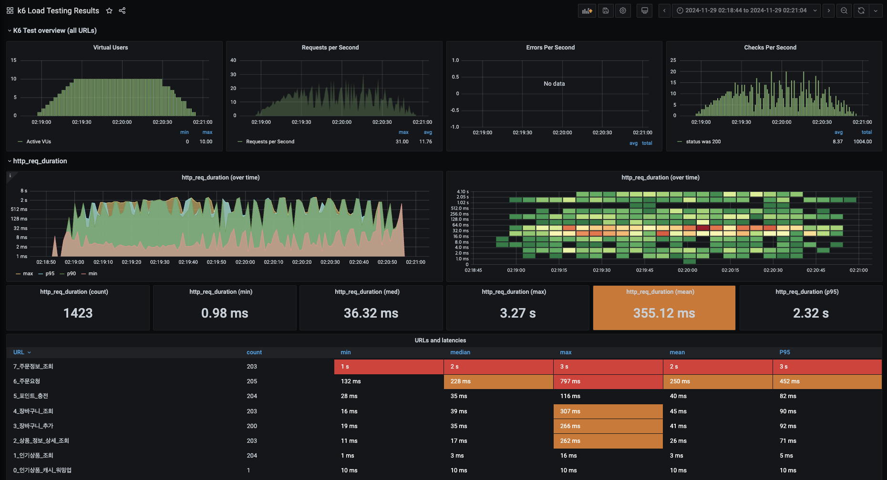
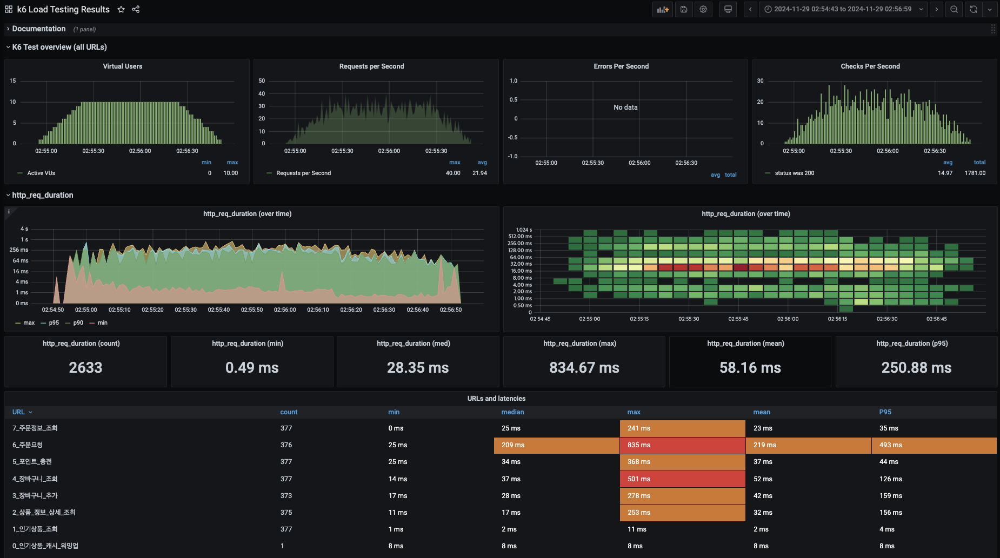

## 📄 **성능 테스트 보고서 (인덱스 적용 후)**

---

[목차]
- 1차 인덱스 적용
- 2차 인덱스 적용

---

## **1차 인덱스 적용**
### 결과


### **성능 테스트 보고서 (인덱스 적용 후)**

## **1. 개선 내용**
- Order 테이블: `user_id` 컬럼에 인덱스 추가
- Cart 테이블: `user_id` 컬럼에 인덱스 추가
```mysql
-- Order 테이블 인덱스
CREATE INDEX idx_order_user_id ON `order` (user_id);

-- Cart 테이블 인덱스
CREATE INDEX idx_cart_user_id ON cart (user_id);
```


### **성능 테스트 보고서 (인덱스 적용 후)**

## **1. 개선 내용**
- Order 테이블: `user_id` 컬럼에 인덱스 추가
- Cart 테이블: `user_id` 컬럼에 인덱스 추가

## **2. 성능 비교 분석**

### **개선된 부분**
1. **장바구니 조회** (`3_장바구니_조회`):
    - 평균 응답시간: 41ms
    - 최대 응답시간: 266ms
    - P95: 92ms

2. **주문정보 조회** (`7_주문정보_조회`):
    - 평균 응답시간: 2s
    - 최대 응답시간: 3s
    - P95: 3s

### **여전히 개선이 필요한 부분**
1. **주문정보 조회**:
    - 여전히 평균 2초, 최대 3초로 매우 느림
    - 다른 API들(1ms~250ms)에 비해 현저히 느린 응답 시간
    - 전체 API 중 가장 큰 성능 병목 지점

## **3. 문제 분석**

### **주문정보 조회가 느린 원인**
1. **복잡한 데이터 조회**:
    - Order → OrderItem → Product 간의 다중 조인
    - 각 주문별 상세 정보 조회 시 N+1 문제 발생 가능성

2. **인덱스 활용 미흡**:
    - `user_id` 인덱스만으로는 충분한 성능 개선이 이루어지지 않음
    - 조인 시 추가적인 인덱스 필요 가능성

## **4. 개선 제안**

### **추가 인덱스 적용**:
```mysql
-- OrderItem 테이블에 인덱스 추가
CREATE INDEX idx_order_item_order_id ON order_item (order_id);
CREATE INDEX idx_order_item_product_id ON order_item (product_id);
```

---

## ** 2차 인덱스 적용 **
## **1. 개선 내용**
```mysql
CREATE INDEX idx_order_item_order_id ON order_item (order_id);
CREATE INDEX idx_order_item_product_id ON order_item (product_id);
```

## **2. 성능 비교 분석**
### 결과

### **개선된 부분**
1. **주문정보 조회** (`7_주문정보_조회`):
    - 평균 응답시간: 2s → 23ms (약 98.8% 개선)
    - 최대 응답시간: 3s → 241ms (약 92% 개선)
    - P95: 3s → 35ms (약 98.8% 개선)

2. **전체 시스템 성능**:
    - 전체 평균 응답시간: 355.12ms → 58.16ms (약 83.6% 개선)
    - 전체 최대 응답시간: 3.27s → 834.67ms (약 74.5% 개선)
    - 전체 P95: 2.32s → 250.88ms (약 89.2% 개선)

### **주목할 만한 변화**
1. **요청 처리량**:
    - 이전: 1,423 요청
    - 이후: 2,633 요청 (약 85% 증가)

2. **안정성 향상**:
    - 응답시간의 편차가 크게 감소
    - 최소-최대 응답시간 간격 축소

## **3. 분석 및 시사점**

### **성능 개선 원인**
1. **조인 성능 향상**:
    - `order_id` 인덱스로 Order-OrderItem 조인 최적화
    - `product_id` 인덱스로 OrderItem-Product 조인 최적화

2. **데이터 접근 패턴 개선**:
    - 인덱스를 통한 효율적인 데이터 검색
    - 테이블 풀 스캔 감소

## **4. 남은 과제**

### **추가 최적화 포인트**
1. **주문 생성** (`6_주문요청`):
    - 최대 응답시간: 835ms
    - P95: 493ms
    - 트랜잭션 최적화 검토 필요

2. **장바구니 관련 작업**:
    - 평균 42ms로 양호하나 최대 278ms 기록
    - 대량 요청 시 안정성 확보 필요

## **5. 결론**
- OrderItem 테이블의 인덱스 추가로 주문 조회 성능이 극적으로 개선됨
- 시스템 전반의 응답시간과 처리량이 크게 향상됨
- 주문 생성 프로세스에 대한 추가 최적화 필요

## **6. 추후 개선할 문제**
1. 주문 생성 프로세스 최적화
2. 대량 트래픽 상황에서의 안정성 테스트
3. 캐싱 전략 수립 및 적용 검토
