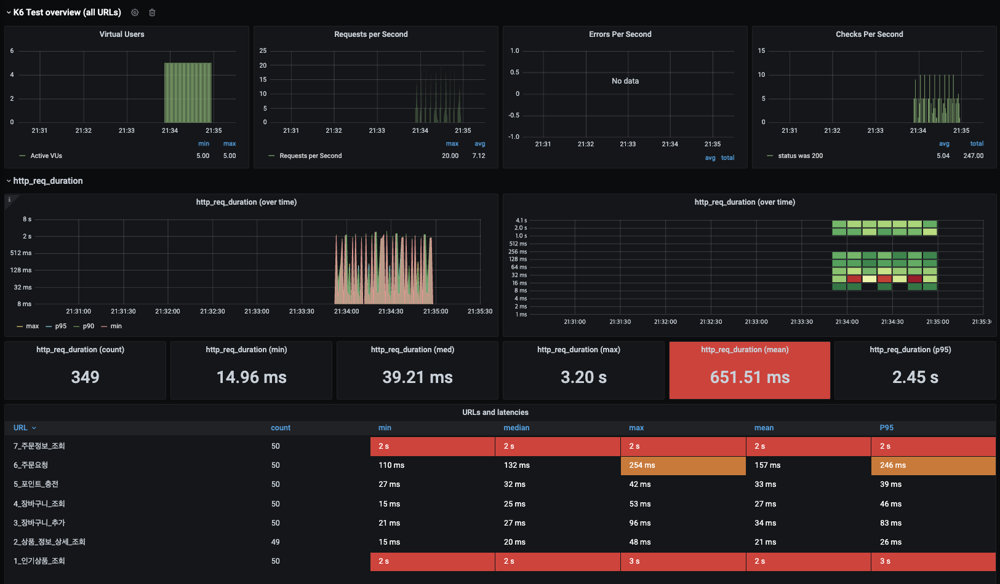

# **성능 테스트 보고서**

## **1. 테스트 결과 요약**
### **테스트 환경**
- **테스트 도구**: K6
- **테스트 대상**: API 서버
- **가상 사용자 수(VU)**: 5명
- **테스트 실행 시간**: 약 4분
- **총 요청 수**: 349건

---

> Step 19에서는 개선되지않은 상태로 테스트를 돌렸으며 이 결과를 바탕으로 
> Step 20에서 개산방안 적용 및 추가 테스트를 진행 할 예정입니다.

### **성능 지표**
- **평균 응답 시간 (mean)**: 651.51ms
- **최대 응답 시간 (max)**: 3.2s
- **P95 응답 시간**: 2.45s
- **최소 응답 시간 (min)**: 14.96ms
- **요청 처리량 (Requests Per Second)**: 최대 20.0 req/s, 평균 7.12 req/s
- **에러율**: 0% (에러 없음)
- **성공적인 응답 상태 코드(200)**: 247건

---

### **URL별 성능 요약**
| API 명칭                | 요청 수 | 최소(ms) | 중앙값(ms) | 평균(ms) | 최대(ms) | P95(ms) |
|-------------------------|---------|----------|------------|----------|----------|---------|
| 인기상품 조회           | 50      | 2,000    | 2,000      | 2,000    | 2,000    | 2,000   |
| 상품 정보 상세 조회     | 50      | 15       | 20         | 21       | 48       | 26      |
| 장바구니 추가           | 50      | 21       | 27         | 34       | 96       | 83      |
| 장바구니 조회           | 50      | 15       | 25         | 27       | 53       | 46      |
| 포인트 충전            | 50      | 27       | 32         | 33       | 42       | 39      |
| 주문 요청              | 50      | 110      | 132        | 157      | 254      | 246     |
| 주문정보 조회           | 49      | 2,000    | 2,000      | 2,000    | 2,000    | 2,000   |

---

## **2. 장애 탐지 및 병목 구간**
1. **주요 장애 탐지**
    - `인기상품 조회` 및 `주문정보 조회` API에서 응답 시간이 **2초**로 고정.
    - `주문 요청` API에서 **최대 254ms**로 응답 지연 발생.

2. **병목 구간 분석**
    - **캐싱 부재**: 반복 호출되는 인기 상품 및 주문 조회 API에서 데이터 캐싱이 없어 고정 응답 시간이 발생.
    - **DB 쿼리 과부하**: 주문 요청 API의 평균 응답 시간이 157ms로, DB 연산 부하 가능성 높음.
    - **서버 리소스 부족**: 동시 사용자 5명만으로 평균 응답 시간이 651ms로 비교적 높은 값 기록. 
    > 하지만 서버 리소스 부족보다는 캐싱과 DB 인덱싱 문제가 더 클것으로 예상됨 개선된 결과를 보고 서버 리소스 판단 예정

---

## **3. 장애 대응 방안**
### **캐싱 레이어 도입**
- **문제**: 정적 또는 반복적으로 호출되는 데이터(API 응답 데이터)가 캐싱되지 않음.
- **대응 방안**:
    - Redis 캐싱 도입.
    - `인기상품 조회`, `주문정보 조회` API 응답을 캐싱하여 처리 속도 향상.

### **DB 최적화**
- **문제**: 주문 요청 API의 응답 시간이 DB 쿼리 과부하로 보임.
- **대응 방안**:
    - 쿼리 실행 계획 분석(Explain) 및 비효율적 쿼리 수정.
    - 조회 쿼리에 적합한 인덱스 추가.

### **서버 리소스 증설**
- **문제**: 5명의 가상 사용자를 기준으로 평균 응답 시간이 높게 나옴.
- **대응 방안**:
    - 캐싱, 인덱스로 개선 이후 판단 예정

---

## **4. 결론 및 향후 계획**
### **결론**
- 현 상태에서는 5명의 동시 사용자가 서버에 부하를 주는 시점부터 응답 시간이 증가하고, 일부 API에서 고정적인 대기 시간이 발생.
- 응답 시간과 병목 현상을 해결하기 위해 캐싱, DB 최적화 등이 필요.

### **향후 계획**
1. **1차 목표**:
    - 캐싱 레이어 적용
    - DB 쿼리 최적화 및 인덱스 추가
2. **2차 목표**:
    - 로드 테스트 확장(20~50명 가상 사용자 테스트)

--- 
